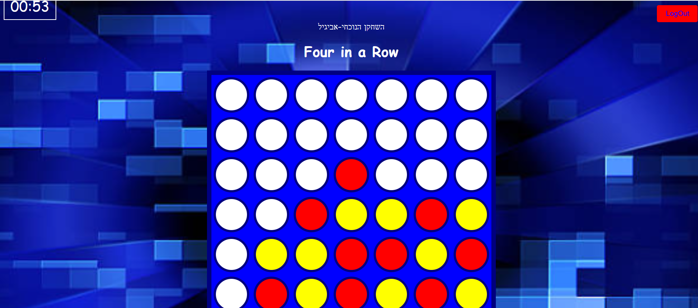

# Connect Four Game 🎮

An interactive **Connect Four** game built with **HTML, CSS, and JavaScript**.  
The project includes a full user flow with login, game board, winner screen, and score tracking.  
It demonstrates skills in **DOM manipulation, event handling, localStorage, and UI design**.

## ✨ Features
- 🎲 **Two-player gameplay** with customizable names and colors
- ⏱️ **Timer** that tracks game duration
- 🏆 **Winner screen** with player details and game time
- 📊 **Game history table** with the best time highlighted
- 🔑 **Login & Signup system** with localStorage
- 🎶 **Sound effects** for clicks and winning moments
- 📱 **Responsive design** that works across devices

## 🛠️ Technologies Used
- HTML5  
- CSS3  
- JavaScript (ES6)  
- LocalStorage API

## 📂 Project Structure

The project is organized into multiple folders.  
Each folder contains its own **HTML, CSS, and JavaScript** files to keep the code modular and well-structured.

- **entrancePage/** → Login and user signup pages  
- **choosing/** → Game selection page  
- **game/** → Main Connect Four game board and logic  
- **win/** → Winner screen and game summary  
- **tops/** → Scoreboard and list of best results  
- **homePage/** → Homepage and navigation  
- **music/** → Sound effects used in the game  
- **pictures/** → Images and visual assets  
- **Definitions/** → Shared constants and helper files  

This structure allows clear separation of concerns and makes the project easy to navigate.
## 📸 Screenshots

### Game Board

## ▶️ How to Run
1. Clone or download the project files.  
2. Open `entrancePage/login.html` in your browser.  
3. Sign up / log in to create a session.  
4. Choose the **Four in a Row** game and start playing!
